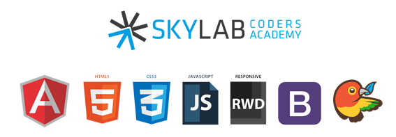
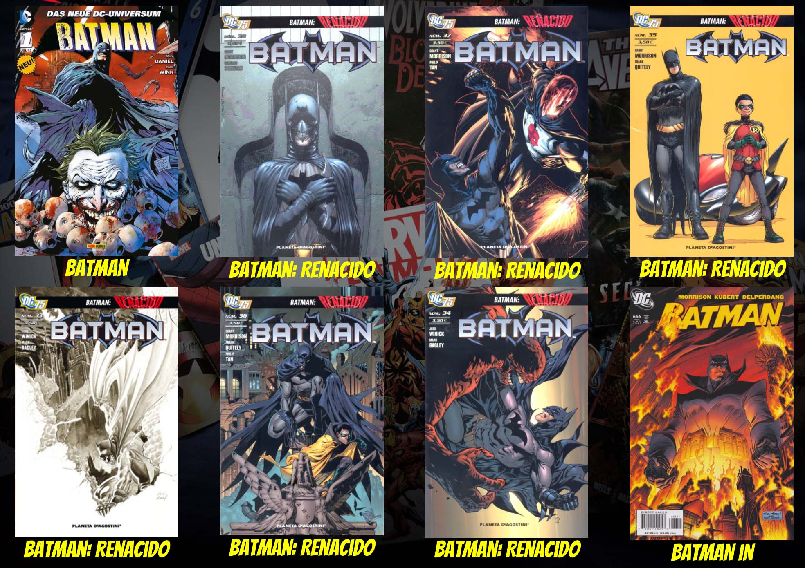
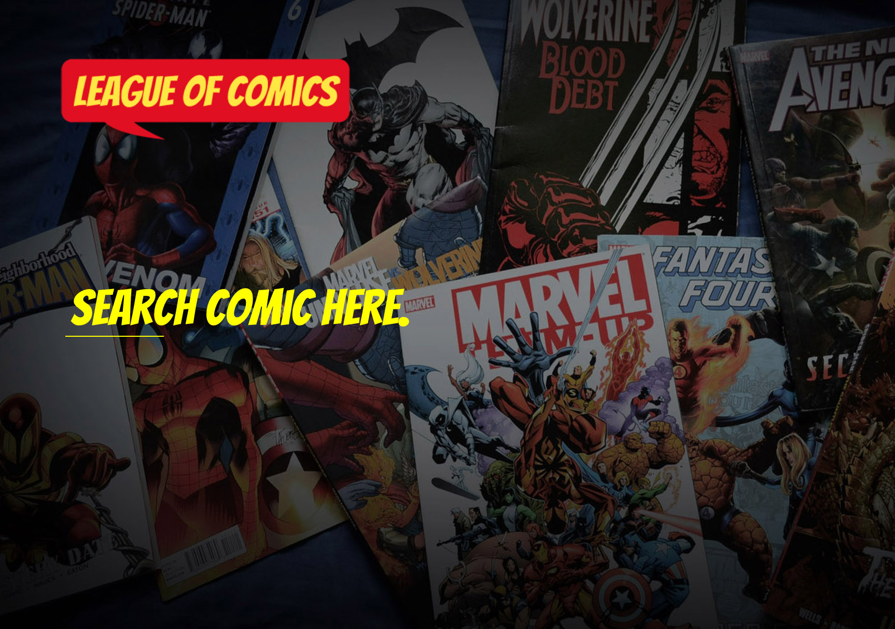

# League of Comics Angular App

This repository contains our first team app project developed with AngularJS.  Our app allows you to search **comics** and find information about them like covers, publish dates and a description of the volume. The API we used is called **[Comic Vine](https://comicvine.gamespot.com/api/)** and we apprecciate their support!

The app was coded  with the text editor [Sublime Text 3](https://www.sublimetext.com/)

## Comming soon...

New search by Author, by character and date
Ranking for most popular comics and a _Like Button_
Order by date, alphabetical, etc. 

## Authors

[Jose Ángel](https://github.com/joseangelbarrera)

[Sergio](https://github.com/misan7)

[Yair](https://github.com/Riay)

## Acknowledgments

[Skylab Coders](http://www.skylabcoders.com/en)

[JuanMa Garrido](https://github.com/juanmaguitar)

[Alejandro DG](https://github.com/agandia9)

[Ignasi Amargós](https://github.com/Iggy-Codes)

Link to our app [here](https://misan7.github.io/league-of-comics-app/)!

